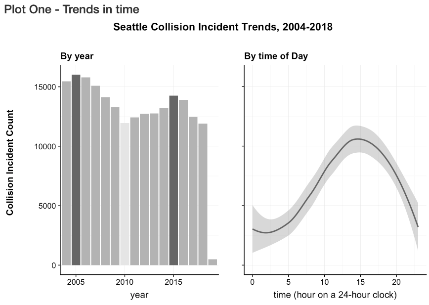

# Seattle-Collisions

This project uses Seattle Collisions data* to compare 5 data analyst methods of cleaning, exploring and reporting data using Python, R, SQL, Excel, and Tableau.

The motivation behind this project is two-fold:
1. practice wrangling, exploring and storytelling with data
2. identify commonalities, strengths and weaknesses of various toolsets used for wrangling, exploring and storytelling

### *Seattle Collisions Data
The [Seattle Collisions](https://data-seattlecitygis.opendata.arcgis.com/datasets/collisions) dataset is a compilation of over 200,000 collision reports created by Seattle Police Department (SPD) that were then recorded by Seattle Department of Transportation (SDOT), starting in 2004 and updated regularly.

## Project Status
This project a work in progress. The R method is actively being refined and will act as the standard against which the Python, SQL, Excel, and Tableau modules will be developed.

## How to Contribute

I encourage you to submit pull requests.

Please use the [Udacity Git Commit Message Style Guide](https://udacity.github.io/git-styleguide/), and follow the "fork-and-pull" Git workflow:

1. Fork the repo on GitHub
1. Clone the project to your own computer
1. Commit changes to your own branch
1. Push your work back up to your fork
1. Submit a Pull request so that I can review your changes

Note: Please take care to merge the latest from "upstream" before making a pull request.

### To Do
~~* Download data programmatically~~
* Improve documentation:
* * For better transparency, move data cleaning/change discussions outside the code.
* * Document the project as a whole
* Improve R Studio version: 
* * Improve visuals (for better storytelling)
* * Create functions for repeated visuals
* Enhance R Studio version: add geo
* Make R Studio version viewable
* Add Python method
* Add SQL method
* Add Tableau method
* Write and publish formal project report

## Files and Directories
*R* - R Studio notebooks for wrangling and analyzing data

*Collisions_OD.pdf* - Metadata (also found here: https://www.seattle.gov/Documents/Departments/SDOT/GIS/Collisions_OD.pdf)
